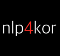

# nlp4kor
- Natural Language Processing for Korean with Deep Learning
- 딥러닝을 이용한 한글 자연어 처리
- 발표자료는 발표(행아웃) 후 공개되며, 동영상은 다음 발표전 까지 공개됩니다.
- 발표자료/동영상에 대한 오류 수정 및 피드백은 nlp4kor@gmail.com 로 주시면 최대한 반영하겠습니다.
- 소스 설치 및 실행에 대한 내용은 [INSTALL.md](https://github.com/bage79/nlp4kor/blob/master/INSTALL.md) 를 참조해주시기 바랍니다.

## Season #1 2017.05 ~ 2017.08 (FFNN, CNN, word2vec)

### 1. CNN for MNIST - 박혜웅, 2017.05.20
- http://nbviewer.jupyter.org/github/bage79/nlp4kor/blob/master/ipynb/CNN_for_MNIST.ipynb
- https://youtu.be/0UkAV3DnpPk?list=PLE_yleP-KQefhFSNh16hJKnq6stIG05fu

### 2. FFNN for 한글 띄어쓰기 - 박혜웅, 2017.06.03
- http://nbviewer.jupyter.org/github/bage79/nlp4kor/blob/master/ipynb/FFNN_for_word-spaceing.ipynb
- 
